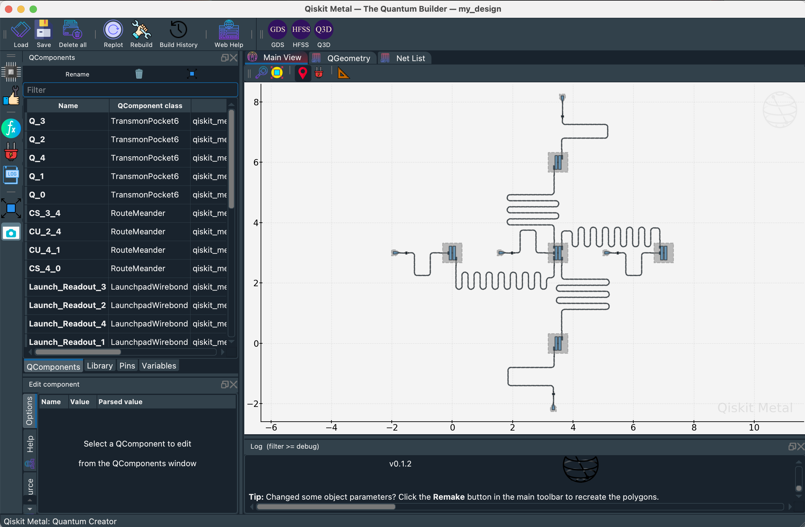

# MQHAD

Munich Quantum HArdware Designer (MQHAD) is an early-stage toolkit that is envisioned to automatically generate quantum chip design from a quantum circuit. This work adapts and integrates the work of [G. Li, Y. Ding and Y. Xie](https://arxiv.org/abs/1911.12879) and [Qiskit Metal](https://qiskit.org/documentation/metal/) into a seamless workflow for quantum chip design while improving the code resilience through test suites and performance improvements.

- [MQHAD](#mqhad)
  - [Installation](#installation)
    - [Installing Package](#installing-package)
    - [Installing Qiskit Metal](#installing-qiskit-metal)
  - [Usage](#usage)
    - [Command-line interface (CLI)](#command-line-interface-cli)
    - [Testing the Package](#testing-the-package)
  - [Development](#development)
  - [FAQs](#faqs)

## Installation

### Installing Package

1. Clone the repository - `git clone {URL}`

2. Change to cloned directory - `cd mqhad`

3. The easiest way to install the toolkit without affecting other packages is to create a virtual environment, i.e: using conda, as following. Else, you can just run `python -m pip install -e .`. Do note that MQHAD is tested on Python 3.10.

```text
conda env create -n <env_name> environment.yml
conda activate <env_name>
python -m pip install --no-deps -e .
```

### Installing Qiskit Metal

1. Install Qiskit Metal following installation instructions at [Qiskit Metal](https://qiskit.org/documentation/metal/installation.html). Refer to the [Pre-existing environment](https://qiskit.org/documentation/metal/installation.html#option-2-a-pre-existing-environment) section.

## Usage

### Command-line interface (CLI)

```text
Usage:
    mqhad --file-path [PATH_TO_QASM_2.0_FILE] --config-file-path [PATH_TO_CONFIG_FILE]
```

The CLI will generate the high-level architecture of the placement of qubits in a 2D square-lattice and the corresponding qubit frequencies. The Metal GUI is invoked at the end as following where there is an option to save the design as a Python script.



### Testing the Package

1. There is a test circuit that could be used to test the package. Navigate to `mqhad` directory and execute `mqhad --file-path ./mqhad/tests/test_circuit/circuit1.qasm --config-file-path ./mqhad/tests/test_config/config.yml`

## Development

1. On top of normal installation, install development dependencies using `pip install -r requirements-dev.txt`

## FAQs

- QT Warnings

>From [Qiskit Metal FAQ](https://qiskit.org/documentation/metal/faq.html):
>
>Q: Why am I seeing a critical error from qt about not controlling layer-backing?
>
>A: If you are seeing: CRITICAL [_qt_message_handler]: …. WARNING: Layer-backing can not be explicitly controlled on 10.14 when built against the 10.14 SDK … you are likely running a MAC OS version that has trouble with the libraries. Based on information that is available online, this problem does not appear to have a solution. However, it does not seem like this error affects Qiskit Metal’s functionality. If you find problem with this, you might want to try using an older version of the dependency packages, beginning with lowering your python version to 3.7.x.
