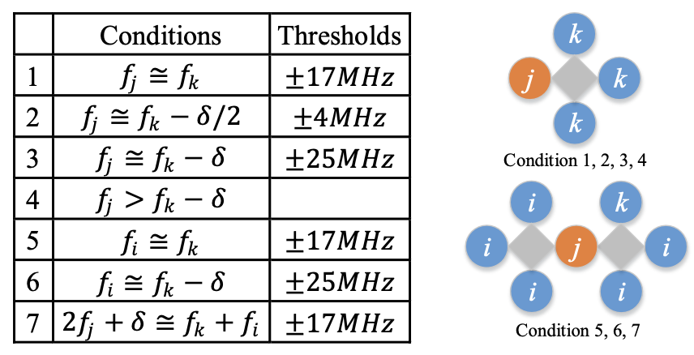

# TODOs

This document lists the experimental features and TODOs

- [TODOs](#todos)
  - [Experimental Features](#experimental-features)
    - [Vectorized Yield Simulator](#vectorized-yield-simulator)
  - [Future Improvements](#future-improvements)

## Experimental Features

### Vectorized Yield Simulator

Yield simulation is used in frequency allocation to detect common collisions in frequency allocation. The image below from ([G. Li, Y. Ding and Y. Xie](https://arxiv.org/abs/1911.12879)) lists the conditions and their thresholds.

Injecting random noise from a Gaussian distribution into pre-fabrication qubit frequencies enables a yield simulator to accurately model post-fabrication frequencies. The Monte Carlo simulations allow the successful fabrications of a quantum processor design to be accurately modeled, and the resulting yield rate to be estimated. Through repeated runs of the simulation process, the successful simulations are calculated in relation to all simulations, thereby providing an accurate estimate of the overall yield rate. Furthermore, the use of this simulation process enables a more precise analysis of the effects of the random noise on the pre-fabrication qubit frequencies, allowing for more precise estimates of the yield rate.

In this toolkit, a new vectorized yield simulator called [YieldSimulator2](mqhad/architecture_generator/yieldsimulator/yieldsimulator2.py) is implemented. It is still experimental as the performance for the yield simulator needs to be benchmarked. It's hypothesized that the new yield simulator can handle large quantum hardware layout given it's vectorized nature. For further information, see [Future Improvements](#future-improvements) section. Currently, the unvectorized yield simulator [YieldSimulator](mqhad/architecture_generator/yieldsimulator/yieldsimulator.py) is used as the default yield simulator.

## Future Improvements

- [ ] Make random seed in YieldSimulator and YieldSimulator2 configurable for the user

- [ ] Make it easy for user to configure which yield simulator they want to use

- [ ] Experiment further speed up in YieldSimulator2. For instance, using JAX, jit, etc. The initial mask creation takes a bit of time. Maybe the `itertools.combinations` can be improved, taking inspiration from <https://stackoverflow.com/a/16008578/1893470>.

- [ ] Currently Generator is expecting a Qiskit QuantumCircuit. This dependency can be removed to be more generic. Possibly, supporting other libraries' circuits, i.e: Cirq, Q#, etc.

- [ ] Add examples on how to use the package in another program as an alternative to using the toolkit in CLI mode.

- [ ] Increase test coverage, notably on edge cases. For instance, the designer module has a considerable amount of if-else statement which would be good to be tested. Probably, an AI unit test case generator or analyzers, i.e: [Pynguin—PYthoN General UnIt test geNerator](https://pynguin.readthedocs.io/en/latest/) could be used to generate test cases.

- [ ] Refactor Frequency class. Frequency class can be refactored to make the functions leaner and more testable.

- [ ] Save output of Metal design as Python script using [DesignPlanar.to_python_script](https://qiskit.org/documentation/metal/stubs/qiskit_metal.designs.DesignPlanar.to_python_script.html#qiskit_metal.designs.DesignPlanar.to_python_script). Potentially, there is no need to have the MetalGUI opened. If this is possible, the user can be given the option to either open the GUI and/or generate a Python script containing their design.

- [ ] The Design class can be refactored to follow a creational pattern, i.e: Factory, AbstractFactory, Builder etc. to make it more extensible and modular. Refer [here](https://refactoring.guru/design-patterns/creational-patterns). The steps to construct a layout can be harmonized into a series of steps defined in an interface that can be implemented by different concrete implementation classes. The idea is to support various Metal designs and possibly other hardware designer backend seamlessly in the future.

- [ ] Add better progress indicator for the steps using progress indicators, i.e: [tqdm](https://github.com/tqdm/tqdm). Currently, some steps such as generating qubit frequencies takes time and there is no granular indicator on the progress other than a simple text message.

- [ ] After tool execution in MacOS Ventura 13.0, there is a segmentation fault message `zsh: segmentation fault  mqhad --file-path ./mqhad/tests/test_circuit/circuit1.qasm`. Investigate why this issue is happening.

- [ ] Refactor config.yml file parsing to defaults if no value is specified in config. There may be other approaches to elegantly handle configurations in a config file which can be explored.
